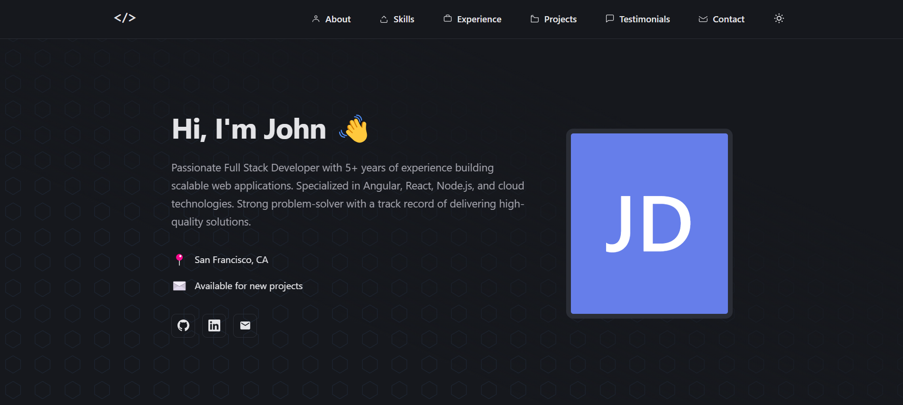
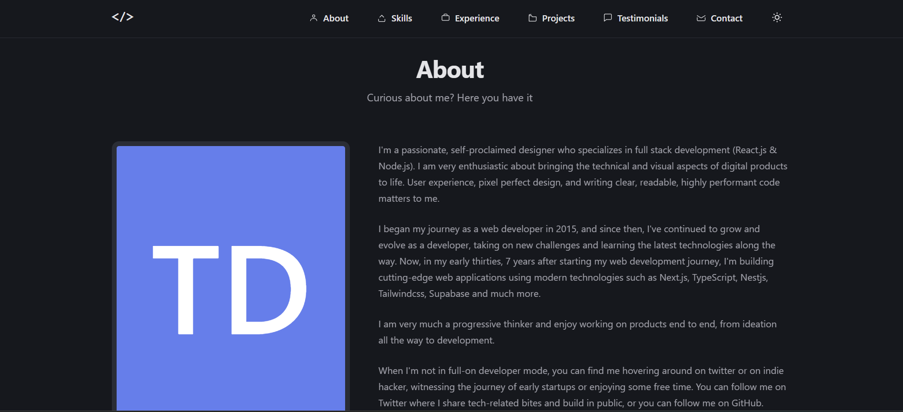
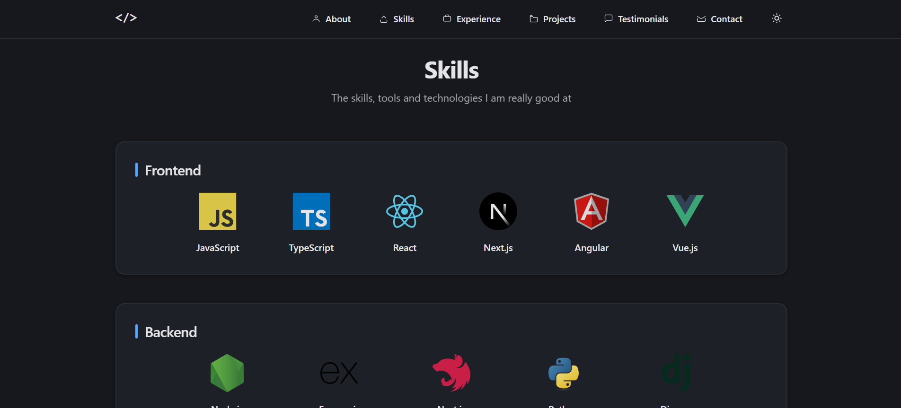
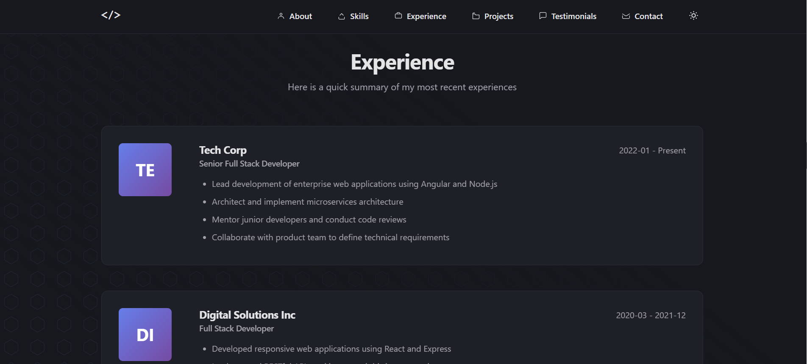
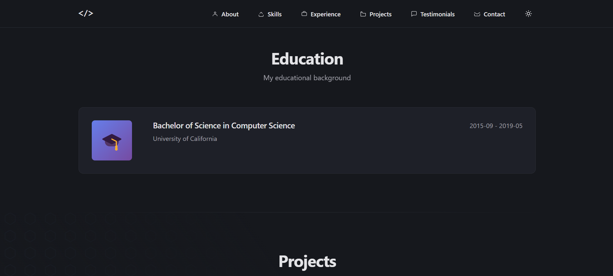
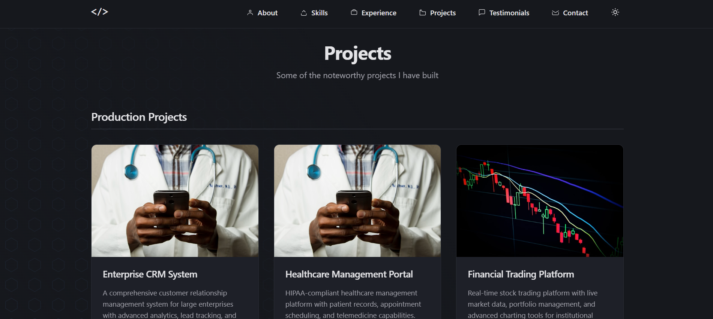
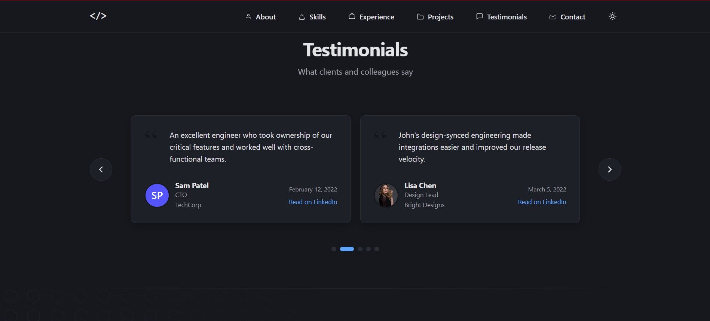

# 🚀 Portfolio Website Template

A modern, fully customizable portfolio website built with Angular 20. Showcase your skills, experience, projects, and testimonials with this sleek, responsive template.

## 📸 Screenshots

### Dark Theme
<table>
  <tr>
    <td></td>
    <td></td>
  </tr>
  <tr>
    <td></td>
    <td></td>
  </tr>
  <tr>
    <td></td>
    <td></td>
  </tr>
  <tr>
    <td colspan="2"></td>
  </tr>
</table>

### Light Theme
<table>
  <tr>
    <td></td>
    <td></td>
  </tr>
  <tr>
    <td></td>
    <td></td>
  </tr>
  <tr>
    <td></td>
    <td></td>
  </tr>
  <tr>
    <td colspan="2"></td>
  </tr>
</table>

## ✨ Features

- 📱 Fully responsive design
- 🎨 Modern and clean UI
- 🌓 Dark/Light theme support
- 📊 JSON-based content management
- 🔥 Built with Angular 20
- 📝 Easy to customize
- 🎯 Sections included:
  - Hero/Landing section
  - About me
  - Experience timeline
  - Education
  - Skills showcase
  - Production projects
  - Sample projects with GitHub links
  - Testimonials carousel
  - Contact information

## 📖 Documentation

- **[QUICK-START.md](QUICK-START.md)** - Get started in 10 minutes ⚡
- **[PORTFOLIO-DATA-GUIDE.md](PORTFOLIO-DATA-GUIDE.md)** - Complete JSON data reference 📋
- **[FIREBASE-DEPLOYMENT.md](FIREBASE-DEPLOYMENT.md)** - Step-by-step deployment guide 🔥
- **[SCREENSHOTS-GUIDE.md](SCREENSHOTS-GUIDE.md)** - How to add and optimize screenshots 📸
- **[CONTRIBUTING.md](CONTRIBUTING.md)** - Contribution guidelines 🤝

## 📋 Prerequisites

Before you begin, ensure you have the following installed:
- **Node.js** (v18.0 or higher)
- **npm** (comes with Node.js)
- **Angular CLI** (v20.3.10 or higher)

```bash
npm install -g @angular/cli@latest
```

## 🛠️ Installation

1. **Clone the repository**
   ```bash
   git clone https://github.com/SkyThonk/PortfolioJSON.git
   cd PortfolioJSON
   ```

2. **Install dependencies**
   ```bash
   npm install
   ```

3. **Run the development server**
   ```bash
   npm start
   # or
   ng serve
   ```

4. **Open your browser**
   Navigate to `http://localhost:4200/`

## 📝 Customizing Your Portfolio

### Editing Portfolio Data

All your portfolio content is stored in a single JSON file: `src/assets/data/portfolio-data.json`

#### JSON Structure Overview

```json
{
  "personalInfo": { /* Your basic information */ },
  "experiences": [ /* Your work experience */ ],
  "education": [ /* Your educational background */ ],
  "skills": [ /* Skills organized by category */ ],
  "skillItems": [ /* Skills with icons */ ],
  "productionProjects": [ /* Live/Production projects */ ],
  "sampleProjects": [ /* Personal/Demo projects */ ],
  "testimonials": [ /* Client/Colleague testimonials */ ],
  "socialLinks": [ /* Your social media links */ ]
}
```

#### 1. Personal Information

```json
"personalInfo": {
  "name": "Your Name",
  "title": "Your Professional Title",
  "email": "your.email@example.com",
  "phone": "+1 (555) 123-4567",
  "location": "Your City, State",
  "linkedin": "https://linkedin.com/in/yourprofile",
  "github": "https://github.com/yourusername",
  "website": "https://yourwebsite.com",
  "availability": "Available for new projects",
  "summary": "Your professional summary...",
  "avatar": "URL_to_your_avatar_image",
  "about": [
    "First paragraph about yourself...",
    "Second paragraph...",
    "Third paragraph..."
  ],
  "quickFacts": [
    "Fact 1",
    "Fact 2",
    "Fact 3"
  ]
}
```

#### 2. Work Experience

```json
"experiences": [
  {
    "id": "exp1",
    "company": "Company Name",
    "position": "Your Position",
    "location": "City, State",
    "startDate": "2022-01",
    "endDate": "Present",
    "current": true,
    "responsibilities": [
      "Responsibility 1",
      "Responsibility 2",
      "Responsibility 3"
    ],
    "technologies": ["Tech1", "Tech2", "Tech3"]
  }
]
```

#### 3. Education

```json
"education": [
  {
    "id": "edu1",
    "institution": "University Name",
    "degree": "Bachelor of Science",
    "field": "Computer Science",
    "location": "City, State",
    "startDate": "2015-09",
    "endDate": "2019-05",
    "gpa": "3.8",
    "achievements": [
      "Achievement 1",
      "Achievement 2"
    ]
  }
]
```

#### 4. Skills (Simple List)

```json
"skills": [
  {
    "category": "Frontend",
    "items": ["Angular", "React", "Vue.js", "TypeScript"]
  },
  {
    "category": "Backend",
    "items": ["Node.js", "Express", "Python"]
  }
]
```

#### 5. Skills with Icons

```json
"skillItems": [
  {
    "category": "Frontend",
    "skills": [
      {
        "name": "JavaScript",
        "icon": "https://cdn.jsdelivr.net/gh/devicons/devicon/icons/javascript/javascript-original.svg"
      },
      {
        "name": "TypeScript",
        "icon": "https://cdn.jsdelivr.net/gh/devicons/devicon/icons/typescript/typescript-original.svg"
      }
    ]
  }
]
```

**Finding Skill Icons:**
- [DevIcon](https://devicon.dev/) - Technology icons
- [Simple Icons](https://simpleicons.org/) - Brand icons
- [Vector Logo Zone](https://www.vectorlogo.zone/) - Various logos

#### 6. Production Projects

```json
"productionProjects": [
  {
    "id": "prod1",
    "name": "Project Name",
    "description": "Brief description of the project...",
    "technologies": ["Tech1", "Tech2", "Tech3"],
    "imageUrls": [
      "path/to/screenshot1.jpg",
      "path/to/screenshot2.jpg"
    ]
  }
]
```

#### 7. Sample Projects

```json
"sampleProjects": [
  {
    "id": "proj1",
    "name": "Project Name",
    "description": "Project description...",
    "technologies": ["Tech1", "Tech2"],
    "imageUrls": ["path/to/screenshot.jpg"],
    "githubUrl": "https://github.com/yourusername/project",
    "liveUrl": "https://project-demo.com"
  }
]
```

#### 8. Testimonials

```json
"testimonials": [
  {
    "id": "test1",
    "name": "Client Name",
    "imageUrl": "path/to/client/photo.jpg",
    "position": "Their Position",
    "company": "Their Company",
    "text": "Testimonial text...",
    "sourceUrl": "https://linkedin.com/recommendation/link",
    "sourceText": "Read on LinkedIn",
    "date": "January 15, 2024"
  }
]
```

#### 9. Social Links

```json
"socialLinks": [
  {
    "platform": "LinkedIn",
    "url": "https://linkedin.com/in/yourprofile",
    "icon": "linkedin"
  },
  {
    "platform": "GitHub",
    "url": "https://github.com/yourusername",
    "icon": "github"
  }
]
```

### Adding Project Screenshots

1. Add your images to `src/assets/Screenshot/` directory
2. Reference them in JSON using relative paths:
   ```json
   "imageUrls": ["assets/Screenshot/project1.png"]
   ```

## 🏗️ Building for Production

### Build the project

```bash
npm run build
```

This creates an optimized production build in the `dist/Portfolio/browser/` directory.

### Testing the production build locally

You can test your production build locally using any static file server. For example:

```bash
# Using Python
cd dist/Portfolio/browser
python -m http.server 8000

# Using Node.js http-server (install first: npm i -g http-server)
cd dist/Portfolio/browser
http-server -p 8000

# Using npx (no installation needed)
npx http-server dist/Portfolio/browser -p 8000
```

Then open `http://localhost:8000` in your browser.

## 🔥 Firebase Deployment

### Prerequisites

1. **Create a Firebase account** at [firebase.google.com](https://firebase.google.com)
2. **Install Firebase CLI**
   ```bash
   npm install -g firebase-tools
   ```

### Deployment Steps

1. **Login to Firebase**
   ```bash
   firebase login
   ```

2. **Initialize Firebase in your project**
   ```bash
   firebase init
   ```
   
   During initialization:
   - Select **Hosting** using spacebar, then press Enter
   - Choose **Use an existing project** or **Create a new project**
   - Set the public directory to: `dist/Portfolio/browser`
   - Configure as single-page app: **Yes**
   - Set up automatic builds with GitHub: **No** (or Yes if you want)
   - Don't overwrite `index.html` if asked

3. **Build your project**
   ```bash
   ng build --configuration production
   ```

4. **Deploy to Firebase**
   ```bash
   firebase deploy
   ```

5. **Your site is live!** 🎉
   Firebase will provide you with a URL like: `https://your-project.web.app`

### Firebase Configuration File

After running `firebase init`, a `firebase.json` file will be created. It should look like this:

```json
{
  "hosting": {
    "public": "dist/Portfolio/browser",
    "ignore": [
      "firebase.json",
      "**/.*",
      "**/node_modules/**"
    ],
    "rewrites": [
      {
        "source": "**",
        "destination": "/index.html"
      }
    ]
  }
}
```

### Continuous Deployment (Optional)

For automatic deployments on every push:

1. **Set up GitHub Actions** - Create `.github/workflows/firebase-hosting.yml`:
   ```yaml
   name: Deploy to Firebase Hosting
   
   on:
     push:
       branches:
         - main
   
   jobs:
     build_and_deploy:
       runs-on: ubuntu-latest
       steps:
         - uses: actions/checkout@v2
         - name: Setup Node.js
           uses: actions/setup-node@v2
           with:
             node-version: '18'
         - name: Install dependencies
           run: npm ci
         - name: Build
           run: npm run build
         - name: Deploy to Firebase
           uses: FirebaseExtended/action-hosting-deploy@v0
           with:
             repoToken: '${{ secrets.GITHUB_TOKEN }}'
             firebaseServiceAccount: '${{ secrets.FIREBASE_SERVICE_ACCOUNT }}'
             channelId: live
             projectId: your-project-id
   ```

## 📚 Project Structure

```
Portfolio/
├── src/
│   ├── app/
│   │   ├── components/      # All UI components
│   │   │   ├── about/
│   │   │   ├── contact/
│   │   │   ├── education/
│   │   │   ├── experience/
│   │   │   ├── hero/
│   │   │   ├── navbar/
│   │   │   ├── projects/
│   │   │   ├── skills/
│   │   │   └── testimonials/
│   │   ├── directives/      # Custom directives
│   │   ├── models/          # TypeScript interfaces
│   │   ├── services/        # Services for data & theme
│   │   └── pages/           # Page components
│   ├── assets/
│   │   ├── data/
│   │   │   └── portfolio-data.json  # ⭐ Your content here
│   │   └── Screenshot/      # Your project images
│   └── styles.scss          # Global styles
├── angular.json
├── package.json
└── README.md
```

## 🎨 Customizing Styles

- **Global styles**: `src/styles.scss`
- **Component styles**: Each component has its own `.scss` file
- **Theme service**: `src/app/services/theme.service.ts`

## 🐛 Troubleshooting

### Build errors
```bash
# Clear cache and reinstall
rm -rf node_modules package-lock.json
npm install
```

### Port already in use
```bash
# Run on different port
ng serve --port 4201
```

### Firebase deployment fails
```bash
# Ensure you're logged in
firebase login --reauth

# Check Firebase project
firebase projects:list
```

## 📱 Browser Support

- Chrome (latest)
- Firefox (latest)
- Safari (latest)
- Edge (latest)

## 🤝 Contributing

Contributions are welcome! Feel free to:
1. Fork the project
2. Create your feature branch (`git checkout -b feature/AmazingFeature`)
3. Commit your changes (`git commit -m 'Add some AmazingFeature'`)
4. Push to the branch (`git push origin feature/AmazingFeature`)
5. Open a Pull Request

## 📄 License

This project is open source and available under the [MIT License](LICENSE).

## 👨‍💻 Author

**SkyThonk**
- GitHub: [@SkyThonk](https://github.com/SkyThonk)
- Repository: [PortfolioJSON](https://github.com/SkyThonk/PortfolioJSON)

## 🙏 Acknowledgments

- Built with [Angular](https://angular.io/)
- Icons from [DevIcon](https://devicon.dev/)
- Deployed on [Firebase](https://firebase.google.com/)

---

⭐ If you found this helpful, please give it a star!

## 📧 Support

If you have any questions or need help, please open an issue on GitHub.
